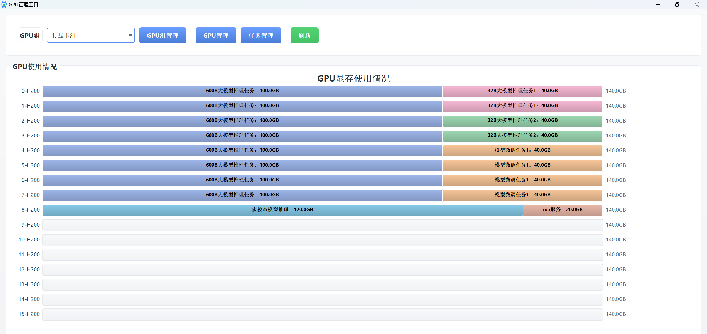

# GPU管理工具

一个基于 PyQt5 的 GPU 显存管理和可视化工具。

## 开发背景

在跨节点、集群环境中管理 GPU 显存及任务分配往往比较复杂和繁琐。传统的命令行工具或分散的脚本难以提供直观的可视化界面，导致：
- 难以快速了解各 GPU 的显存使用情况
- 任务与 GPU 的分配关系不够清晰
- 缺乏统一的配置管理界面
- 跨节点资源协调困难

为了解决这些问题，开发了这款 GPU 管理工具，提供图形化界面，让 GPU 显存管理和任务分配变得更加简单直观。

## 软件截图



## 功能特性

- 📊 **可视化图表**：直观展示各 GPU 的显存使用情况，清晰呈现显存分配状态
- 🎯 **GPU组管理**：管理不同节点的GPU组，每个GPU组代表一个节点的 GPU 集合
- 💻 **GPU管理**：在每个GPU组中添加和管理具体的GPU设备，设置GPU名称和总显存容量
- 📋 **任务管理**：管理跨节点、跨GPU或单GPU的任务，为每个任务分配所需的显存资源
- 💾 **显存分配**：灵活分配任务到不同GPU，支持单GPU独占或多GPU共享的显存分配策略


## 环境要求

- Python 3.7+
- PyQt5 >= 5.15.0
- numpy >= 1.21.0

## 安装依赖

```bash
pip install -r requirements.txt
```

## 运行

```bash
python main.py
```

## 打包成 EXE

```bash
python build_exe.py
```

打包完成后，exe 文件位于 `dist` 文件夹中。

## 项目结构

```
.
├── main.py                 # 程序入口
├── data_manager.py         # 数据管理模块
├── ui/                     # UI 模块
│   ├── main_window.py     # 主窗口
│   ├── chart_widget.py    # 图表组件
│   └── dialogs/           # 对话框
├── icons/                  # 图标资源
└── build_exe.py           # 打包脚本
```

## 许可证

MIT License
